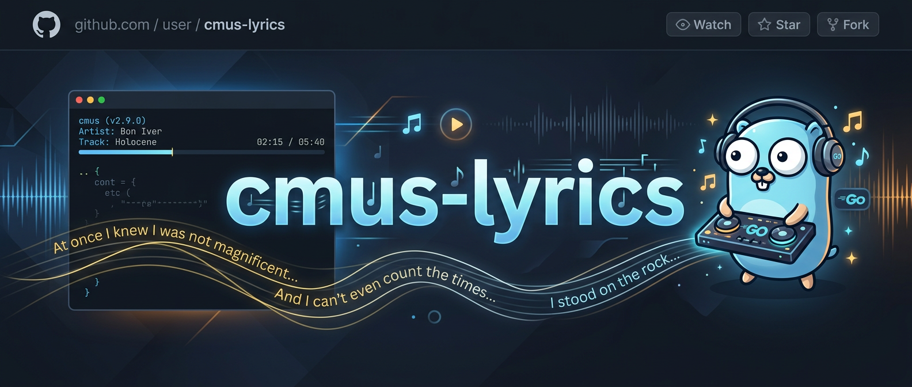
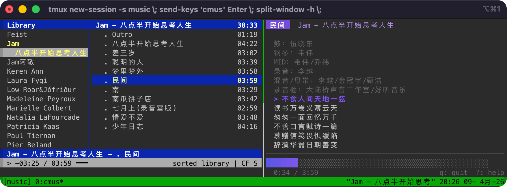

<p align="center">
  
</p>

<p align="center">
  <a href="https://go.dev/"></a>
  <a href="https://github.com/charmbracelet/bubbletea"></a>
  <a href="https://github.com/charmbracelet/lipgloss"></a>
  <a href="https://github.com/charmbracelet/bubbles"></a>
  <a href="https://lrclib.net"></a>
  <a href="https://github.com/index-null/cmus-lyric/releases/latest"></a>
  <a href="https://github.com/index-null/cmus-lyric/blob/master/LICENSE"></a>
</p>

# cmus-lyric

English | [中文](README_zh.md)

A terminal-based synced lyrics viewer for [cmus](https://cmus.github.io/), built with [Bubble Tea](https://github.com/charmbracelet/bubbletea).

> Inspired by [pekrockstar/cmus-lyric](https://github.com/pekrockstar/cmus-lyric), rewritten from scratch with a modern Go stack.

<p align="center">
  
</p>

## Overview

`cmus-lyric` connects to your running cmus instance via Unix socket (with `cmus-remote` fallback), reads the current track, and displays time-synced lyrics in a beautiful TUI. It resolves lyrics from multiple sources — embedded audio tags, local `.lrc` files, a disk cache, and online APIs — all fetched asynchronously without blocking the UI.

**Features:**

- Real-time synced lyric scrolling with highlight
- Auto-fetch from LRCLIB and Netease Music (non-blocking)
- Translation lyrics support (`.t.lrc` / `.t.lyric` side-by-side)
- Embedded lyrics extraction from audio files (ID3/Vorbis Comment)
- Lyrics caching (`~/.cache/cmus-lyric/`) for offline and read-only directories
- Unix socket IPC for low-overhead cmus communication
- GBK/UTF-8 auto-detection
- Progress bar and playback status
- Minimal, distraction-free UI

## Install

### Homebrew (macOS / Linux)

```bash
brew install index-null/tap/lyrics
```

### Shell script

```bash
curl -fsSL https://raw.githubusercontent.com/index-null/cmus-lyric/master/install.sh | bash
```

Or install to a custom directory:

```bash
INSTALL_DIR=~/.local/bin curl -fsSL https://raw.githubusercontent.com/index-null/cmus-lyric/master/install.sh | bash
```

### Go

```bash
go install github.com/index-null/cmus-lyric/cmd/lyrics@latest
```

### Manual download

Download the binary for your platform from the [Releases](https://github.com/index-null/cmus-lyric/releases/latest) page, extract and move to your `PATH`:

```bash
tar xzf cmus-lyric_*_darwin_arm64.tar.gz
sudo install -m 755 lyrics /usr/local/bin/lyrics
```

### From source

```bash
git clone https://github.com/index-null/cmus-lyric.git
cd cmus-lyric
task install   # or: go build -o lyrics ./cmd/lyrics && sudo mv lyrics /usr/local/bin/
```

## Prerequisites

- [cmus](https://cmus.github.io/) music player (must be running)

## Usage

Start cmus and play a song, then in another terminal:

```bash
lyrics
```

| Key          | Action      |
| ------------ | ----------- |
| `q` `Ctrl+C` | Quit        |
| `?`          | Toggle help |

### How lyrics are resolved

1. Extract embedded lyrics from the audio file (ID3 USLT / Vorbis Comment)
2. Look for `<filename>.lrc` or `<filename>.lyric` next to the audio file
3. If a `.t.lrc` / `.t.lyric` file exists alongside, translation lines are shown below each lyric line
4. Check the local cache (`~/.cache/cmus-lyric/`)
5. If nothing is found, fetch from LRCLIB (preferred) then Netease Music, save as `.lrc` and cache

## Project Structure

```
cmus-lyric/
├── cmd/lyrics/           # Application entry point
├── internal/
│   ├── cmus/             # cmus IPC (Unix socket + exec fallback)
│   ├── lyric/            # Lyric loading, parsing, fetching, caching
│   └── player/           # Bubble Tea model, view, styles
├── .github/workflows/    # CI/CD (auto-release on tag)
├── Taskfile.yml          # Build tasks
├── .golangci.yml         # Linter config (v2)
├── lefthook.yml          # Git hooks (fmt + lint + build + test)
├── .goreleaser.yaml      # Release config
├── install.sh            # One-line install script
└── go.mod
```

## Development

```bash
task build          # Build binary to bin/
task run            # Build and run
task lint           # Run golangci-lint
task test           # Run tests
task check          # Full quality check (tidy + lint + test)
```

> [!NOTE]
> Linting requires [golangci-lint](https://golangci-lint.run/). Install with `brew install golangci-lint` or see the [docs](https://golangci-lint.run/welcome/install/).

## Release

Releases are fully automated via GitHub Actions. To create a new release:

```bash
git tag v0.1.0
git push origin v0.1.0
```

This triggers the workflow which:

1. Builds binaries for linux/darwin x amd64/arm64
2. Creates a GitHub Release with checksums
3. Updates the Homebrew tap formula

> [!TIP]
> To preview a release locally: `goreleaser release --snapshot --clean`
